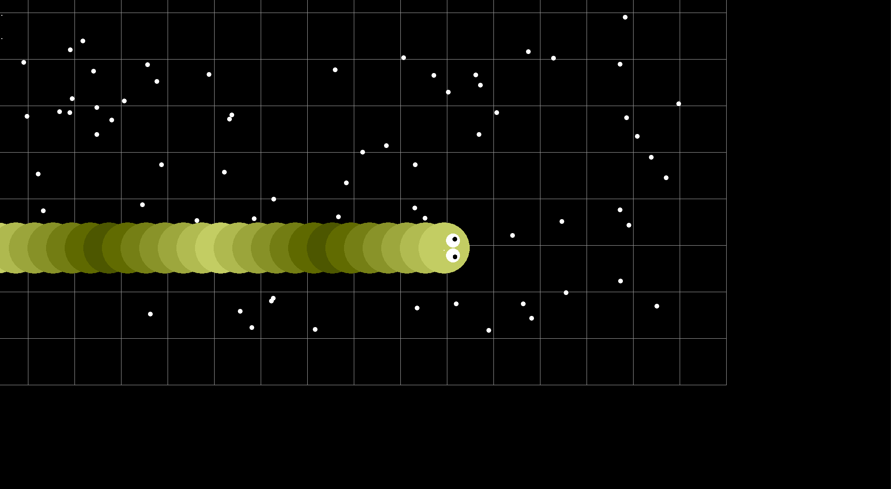
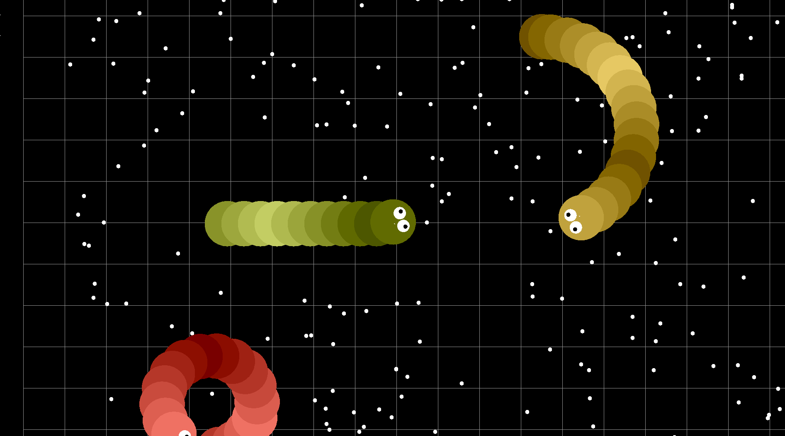
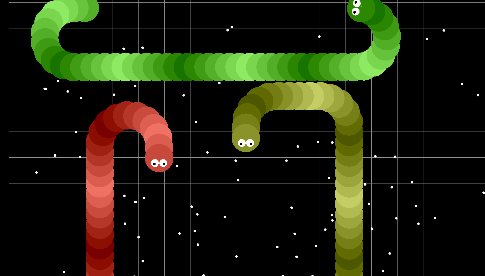

# The-Hungry-Snake 🐍

Control your snake and avoid collusion!

- 🌴 This is the final project of Data Structure instructed by Prof. Ken-Yi Lee at National Taiwan University
- 🥇 Our algorithm is rated 1st/41 teams
- 🎥 Watch our final project demo competition [here](https://www.youtube.com/watch?v=RwqK-bDCWtg&ab_channel=FeisLee)

## Usage

- Set up the environment for using [SFML](https://www.sfml-dev.org/) on your IDE
  - macOS users need to download [SFML for macOS](https://www.sfml-dev.org/download/sfml/2.5.1/), make sure the project has access to your keyboard at privacy setting
  - [Xcode](https://blog.csdn.net/ilovestarbucks/article/details/124425801)
  - [Dev C++](https://programming727.pixnet.net/blog/post/24516428-c++-%E8%A8%AD%E7%BD%AE-sfml-dev-c++)
  - [Visual Studio](http://n.sfs.tw/content/index/14725#azm)
- Add all the source files to your IDE (I use Xcode for building the project)
- Define your controller in `CustomController.h`, and build the project

## How to play

- There are 3 challenges and 3 modes to choose from:
  - 3 challenges
    - Type A: No other snakes
    - Type B: Several other snakes, and they **won't** avoid collusion with you
    - Type C: Several other snakes, and they **will**  avoid collusion with you
  - 3 modes
    - Mode 0: Use your keyboard `up` `down` `left` `right` to control your snake
    - Mode 1: Use the controller defined in `CustomController.h` and run the game with GUI
    - Mode 2: Run till the end without GUI and show the score

## Rules

- The game will end in a period by default
- Every snake is allowed to collide with itself
- Gameover if collide with walls or other snakes
- Eat more dots to get scores

## Folder structure

``` shell
.
├── CMakeLists.txt
├── DSAP-Final
│   ├── DSAP-Final-Info.plist
│   └── Resources
│       └── arial.ttf
├── README.md
├── img
│   ├── TypeA.png
│   ├── TypeB.png
│   └── TypeC.png
└── src
    ├── Config.h
    ├── ConstantDirectionController.h
    ├── ConstantDirectionControllerA.h
    ├── ConstantDirectionControllerB.h
    ├── CustomController.h
    ├── DirectionType.h
    ├── GUI.cpp
    ├── GUI.h
    ├── Game.cpp
    ├── Game.h
    ├── ISnakeController.h
    ├── PlayerController.h
    ├── Position.cpp
    ├── Position.h
    ├── Snake.cpp
    ├── Snake.h
    ├── StraightForwardController.cpp
    ├── StraightForwardController.h
    └── main.cpp

4 directories, 26 files
```

## Default algorithm introduction

- We use the function getCollisionDistance() to determine whether we will collide soon(i.e. in danger)
- If we are in danger, we use DesideTurnDirection() to decide whether we should turn left or right
- We always turn to the direction that is farest from the obstacle in front of us
- If we start to loop, decrease the turing radius of the snake

## A little preview of the game




